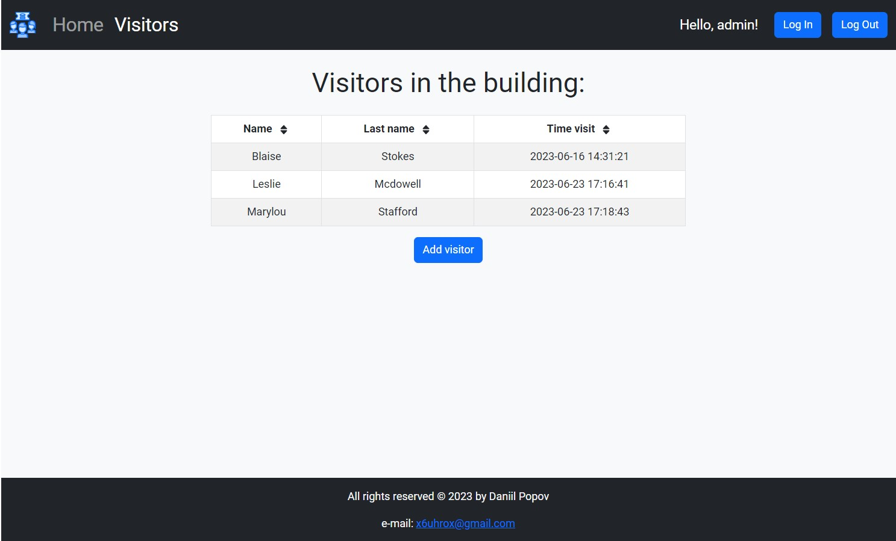

**Мова: [Українська](README.md), [English](README.en.md).**

## Зовнішній вигляд


## Опис проекту

Cервіс для ручного обліку відвідувачів у будівлі в якому задіяний фронтенд і [бекенд](https://github.com/DaniilPopov0809/tech-task-visitors-backend) с записом даних у файл.
Сервіс використовує базову авторизацію через логін/пароль адміністратора.

## Реалізовано

1. Привітальна сторінка
2. Сторінка `Visitors`, на якій відображається інформація про відвідувачів у будівлі у табличному вигляді (ім’я, по батькові,
   час входу до будівлі)
3. До таблиці можна додати, видалити або оновити відвідувача.
4. Таблицю можна фільтрувати за ім’ям, по батьковим та часом входу до будівлі
5. При видаленні, зміні або створенні відвідувача оновлюються дані в таблиці
6. Інформування про видалення, зміні або створення відвідувача
7. Автоматичне перенаправлення користувача у випадку переходу на неіснуючій `route`
8. Авторизація для адміністратора
9. Всі дані про відвідувачів у будівлі доступна тільки при вході в систему

## Стек технологій (фронтенд):


  


## Стек технологій [(бекенд)](https://github.com/DaniilPopov0809/tech-task-visitors-backend):


## Реалізація проекту:

- Проект зібраний за допомогою [create-react-app](https://create-react-app.dev/).
- Компоненти створені з використанням бібліотеки [react-bootstrap](https://react-bootstrap.netlify.app/)
- `backend` створено на Node.js [Visitors-BackEnd](https://github.com/DaniilPopov0809/tech-task-visitors-backend)
- У проекті використовується бібліотека управління станом [ReduxToolkit](https://redux-toolkit.js.org/).
- Необхідні дані зберігаються в `localStorage` використанням бібліотеки [Redux Persist](https://www.npmjs.com/package/redux-persist)

## Запуск фронтенду

```bash
-git clone https://github.com/DaniilPopov0809/tech-task-visitors-frontend.git
-npm i
-npm start
```

## Запуск бекенду

```bash
-git clone https://github.com/DaniilPopov0809/tech-task-visitors-backend.git
-npm i
```

У корні проекту створити файл `.env` та додати в нього наступні дані:

```bas
ADMIN_USERNAME='your_admin_name'
ADMIN_PASSWORD='your_admin_password'
SECRET_KEY='your_secret_key'
```

запустити проект:

```bas
-npm start
```
## Інструкція з використання

1. Кнопка `Login` - залогінитися
2. Кнопка `Logout` - розлогінитися
3. Кнопка `Add visitor` - додати відвідувача
4. Для видалення або оновлення відвідувача натиснути лівою кнопкою на рядку потрібного відвідувача:
    - кнопка Delete - видалити відвідувача
    - кнопка Update - оновити відвідувача
5. `Home` - привітальна сторінка
6. `Visitors` - сторінка с даними про відвідувачів
7. Фільтр при натисканні осередок `Name` `Lastname` `Time visit`
